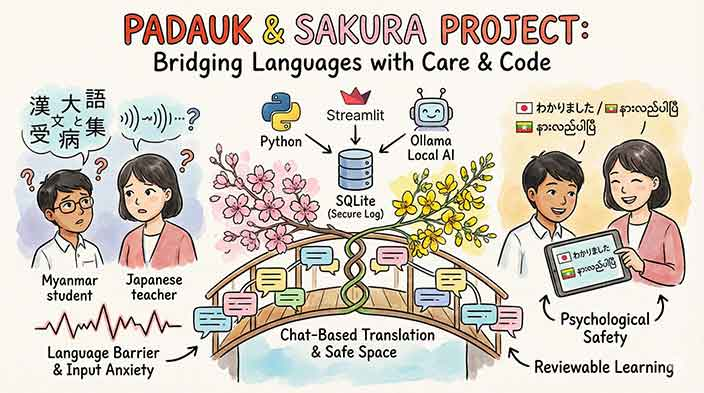

# Padauk & Sakura 🌼🌸




**Padauk & Sakura** is a real-time chat application designed to bridge the language gap between Burmese-speaking students and Japanese-speaking teachers. By leveraging Local LLMs, it provides seamless mutual translation, allowing users to communicate naturally in their native languages.

This application uses **Ollama** to run the **TranslateGemma** model for high-quality translations between Burmese and Japanese.

---

## 🌟 Key Features

* **🇲🇲 ⇄ 🇯🇵 Mutual Translation**: Instant translation for natural dialogue in native tongues.
* **🎓 Educational Focus**: Optimized for communication between teachers and international students.
* **🧵 Thread-Based Conversations**: Organize chats by topic, class, or project.
* **⚡ Real-time Updates**: Optimized UI performance using Streamlit Fragments.
* **🔒 Secure Authentication**: User accounts protected with `bcrypt` password hashing.
* **📊 Data Export**: Export chat logs as CSV (UTF-8 with BOM for Excel compatibility).

## 🛠️ Technology Stack

| Component | Technology |
| :--- | :--- |
| **Frontend** | [Streamlit](https://streamlit.io/) |
| **LLM Orchestration** | [LangChain](https://www.langchain.com/) |
| **AI Model** | [TranslateGemma:4b](https://ollama.com/library/translategemma) |
| **Local LLM Engine** | [Ollama](https://ollama.com/) |
| **Database** | SQLite |

---

## 🚀 Getting Started

### 📋 Prerequisites

1.  **Python 3.9+**
2.  **Ollama**: Download and install from [ollama.com](https://ollama.com/).
3.  **Model**: Pull the translation model:
    ```bash
    ollama pull translategemma:4b
    ```

### ⚙️ Installation & Setup

We recommend using a virtual environment to keep your dependencies isolated.

1.  **Clone the repository**:
    ```bash
    git clone https://github.com/akokubo/padauk_and_sakura.git
    cd padauk_and_sakura
    ```

2.  **Create and activate virtual environment**:
    ```bash
    # For macOS/Linux
    python3 -m venv .venv
    source .venv/bin/activate

    # For Windows
    python -m venv .venv
    .venv\Scripts\activate
    ```

3.  **Install dependencies**:
    ```bash
    pip install --upgrade pip
    pip install -r requirements.txt
    ```

### 💻 Usage

1.  **Ensure Ollama server is running**:
    ```bash
    ollama ls
    ```

2.  **Launch the application**:
    ```bash
    streamlit run app.py
    ```

3.  **Access the Web UI**:
    Open `http://localhost:8501` in your browser.

---

## 📄 License

This project is licensed under the MIT License - see the [LICENSE](LICENSE) file for details.

## 👤 Author

**Atsushi Kokubo**
* [Website](https://akokubo.github.io/)
* [GitHub](https://github.com/akokubo)

---
*Bridging languages and cultures with the power of AI.*
